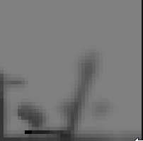
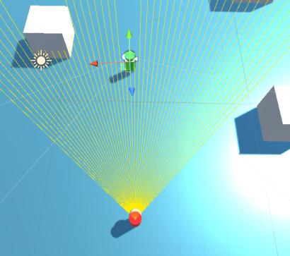

# hide-and-seek
Short project in which an ai agent utilize influence mapping for decision-making, using field-of-view and line-of-sight sensors for populating the map

# Features
## Customized shader for lowpass filtering and decay of influence map

## Field-of-view and line-of-sight functionality, used for a realistic population of influence map

